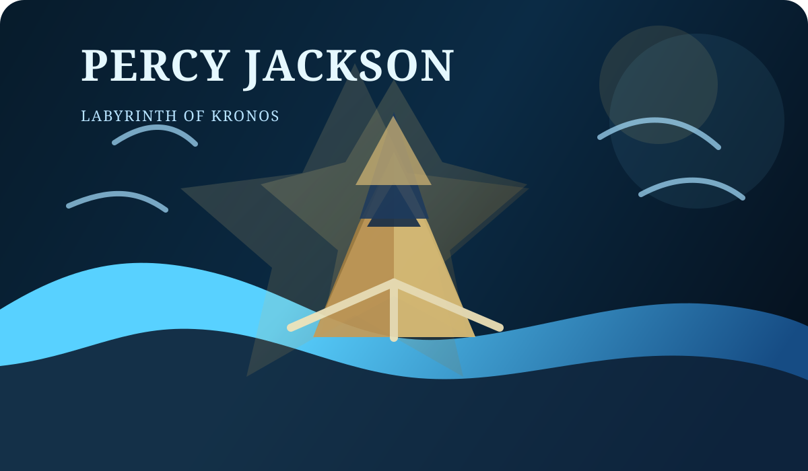

# Percy Jackson: Labyrinth of Kronos

A browser-based interactive story game inspired by the Percy Jackson universe. You play as Percy Jackson as he journeys through the Labyrinth, makes life-or-death decisions, and faces a final confrontation with Kronos.

## Features
- Branching story choices with multiple outcomes
- Health system with win/lose states
- Save and load progress using localStorage
- Expanded ending routes and alternate victory paths
- Fully playable in a browser without a build step

## Project files
- `index.html` — game page structure
- `styles.css` — visual styling and layout
- `script.js` — story scenes, branching logic, health system, and save/load behavior
- `assets/percy-cover.svg` — custom cover art for the game

## How to run it
1. Open the `Percy Jackson` folder.
2. Double-click `index.html` in your file explorer, or open it in a browser.
3. Start playing from the first scene.

## Recommended browser
Use any modern browser such as Chrome, Edge, Firefox, or Safari.

## Gameplay
Each decision changes:
- your health
- the route of the story
- the ending you unlock

Some paths lead to victory, while others end in sacrifice, defeat, or a heroic last stand.

## Notes
This project is a lightweight JavaScript interactive story game and does not require dependency installation or a build process.
